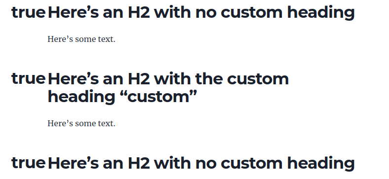

Minimal reproduction for a problem that I'm having with gatsby-remark-autolink-headers. To reproduce:

1. Clone  this repo.
2. Run `yarn install`.
3. Run `yarn develop`.
4. In a web browser, open http://localhost:8000/heading-test/

Expected result: Headings show only the heading text, such as `Here's an H2 with the custom heading "custom"`.

Actual result: Headings start with the text `true`, such as `trueHere's an H2 with the custom heading "custom"`.

